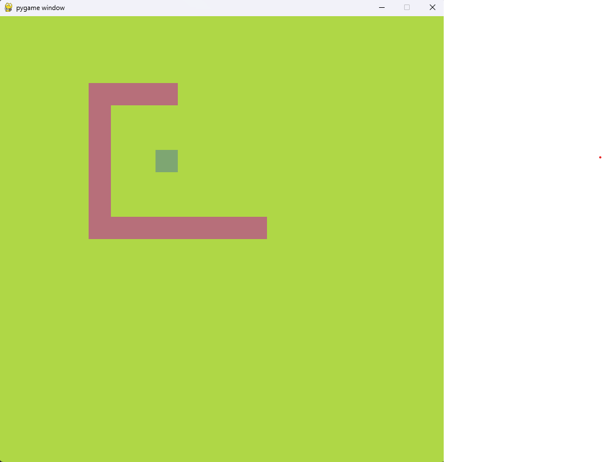

# pygame-snake

Snake game with Pygame

This little project is part of a Pygame Study, it's a Snake game.

How to run:

Create a virtual environment with: 

    python -m venv venv

Activate the virtual environment with:

Windows venv activation

    # In cmd.exe
    venv\Scripts\activate.bat
    # In PowerShell
    venv\Scripts\Activate.ps1

Linux and MacOS venv activation

    $ source myvenv/bin/activate

Install requirements.txt with:

    pip install -r .\requirements.txt

Run the script main.py.

How to play the game:

    left arrow: &#8592;
    upward arrow: &#8593;
    right arrow: &#8594;
    downward arrow: &#8595;

 

 
